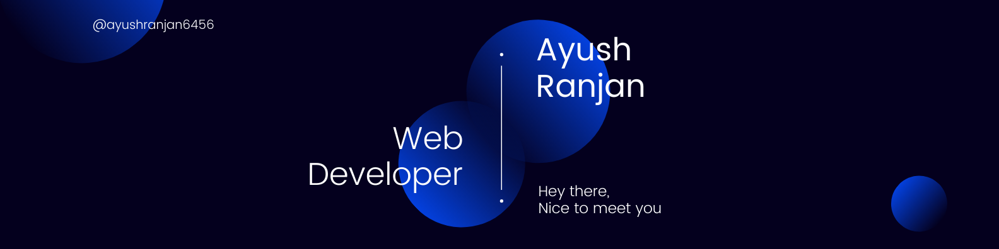

<!--  -->

<h2 align='center'>Ayush Ranjan @ ayushranjan6456</h2>

<b>Undergraduate Student at Vellore Institute of Technology</b>

 

<h2>Hey! there👋</h2>

- I am an aspiring MERN stack web developer with a keen interest in DEVOPS and latest web technologies.

-  <i>Currently:</i> B. Tech Student at Vellore Institute of Technology, Vellore. 

- I have fairly working knowledge on building Restful APIs using NodeJS, ExpressJS and MongoDB

- I also love to participate with my team in hackathons and test my prowess in the limited time frame.

- Apart from MERN staack, I also have beginner's knowledge in Flask, Firebase and SQL.

- I'm currently actively learning REACT framework.

- If not found coding, you can find me reading fiction books, listening music or explore nature outdoors.

<h2>💻 I'm Currently Learning</h2>

**Vellore Institute of Tecnology**

- Object Oriented Programming using C++

- Data Structures and Algorithms 

- Operating Systems

**Other Courses**

- React - The Complete Guide

- Firebase Crash Course

- The Web Developer Bootcamp

<h2>Currently working on:</h2>

<h4>Infographs 📊</h4>

**Infographs** is a project which my team and I developed in April for a hack-a-thon season get proficient in Machine Learning and Deep Learning by building 100 Projects with increasing complexity, over a period of two years.

Check out the GitHub repository:

<h2>👀 Stats</h2>

<!-- <b><em>Now listening to:</em></b>   

-->

<b><em>Overall GitHub Stats:</em></b>  

   

  

 

<h2>📫 Reach out me:</h2>

  
